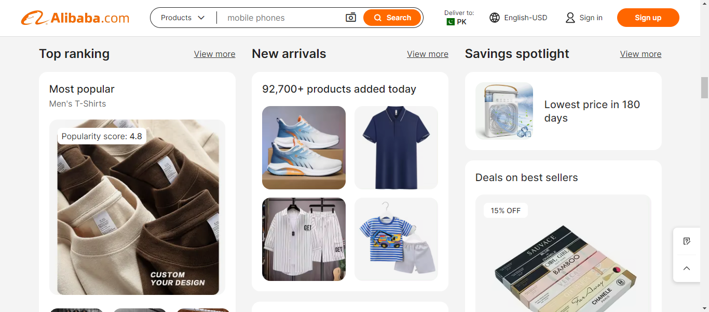
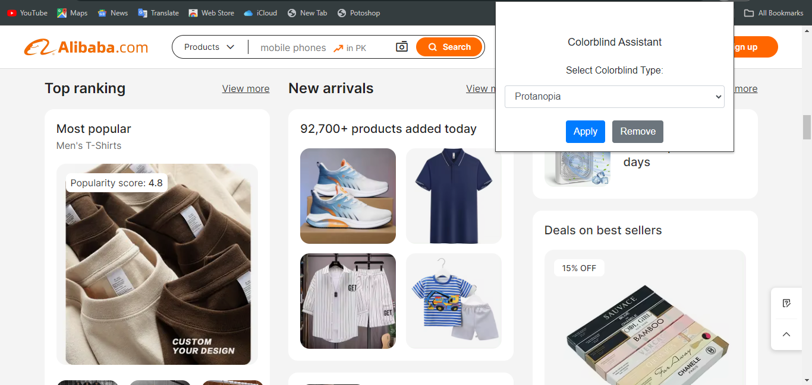

This README includes sections such as project overview, features, installation, usage, contribution guidelines, and licensing information. This will help you to understand and use this Chrome extension effectively.

# Colorblind Assistant Chrome Extension


## Overview

Colorblind Assistant is a Chrome extension designed to assist colorblind users by applying color filters to web pages. This helps in distinguishing colors that are otherwise hard to differentiate. The extension offers filters for Protanopia, Deuteranopia, and Tritanopia, making web browsing more accessible and comfortable for users with different types of color blindness.

## Features

- **Color Filters**: Apply filters for Protanopia, Deuteranopia, and Tritanopia.
- **Easy to Use**: Simple interface to select and apply the desired color filter.
- **Customizable**: Easily remove filters when not needed.

## Screenshots
**Before Filter**

**Apply Filter:** Protanopia

**After Filter**


## Installation

1. **Clone the Repository**:
   ```sh
   git clone https://github.com/Muhammad315/colorblind-assistant.git
   ```
2. **Navigate to the Extension Folder**:
   ```sh
   cd colorblind-assistant
   ```
3. **Load the Extension in Chrome**:
   - Open Chrome and navigate to `chrome://extensions/`.
   - Enable "Developer mode" using the toggle switch in the top right corner.
   - Click on "Load unpacked" and select the directory where you cloned the repository.

## Usage

1. Click on the Colorblind Assistant icon in the Chrome toolbar to open the popup.
2. Select the type of color blindness from the dropdown menu.
3. Click the "Apply" button to apply the filter to the current web page.
4. To remove the filter, click the "Remove" button.

## Development

### Project Structure

```
colorblind-assistant/
│
├── background.js
├── content.js
├── icons/
│   ├── icon16.png
│   ├── icon48.png
│   ├── icon128.png
├── screenshots/
│   ├── screenshot-1.png
│   ├── screenshot-2.png
│   ├── screenshot-3.png
│
├── manifest.json
├── popup.css
├── popup.html
├── popup.js
└── README.md
```

### Key Files

- **background.js**: Handles background tasks such as applying filters on tab updates.
- **content.js**: Applies the selected filter to the web page.
- **popup.html**: The HTML for the popup interface.
- **popup.css**: Custom styles for the popup interface.
- **popup.js**: Handles user interactions within the popup.

## Contributing

Contributions are welcome! Please follow these steps to contribute:

1. **Fork the Repository**: Click the "Fork" button at the top right of this page.
2. **Clone Your Fork**:
   ```sh
   git clone https://github.com/Muhammad315/colorblind-assistant.git
   ```
3. **Create a Branch**:
   ```sh
   git checkout -b feature-branch
   ```
4. **Make Your Changes**: Implement your changes and commit them.
5. **Push to Your Fork**:
   ```sh
   git push origin feature-branch
   ```
6. **Submit a Pull Request**: Open a pull request with a description of your changes.

## License

This project is licensed under the MIT License. See the [LICENSE](LICENSE) file for more information.

## Acknowledgements

- Thanks to [Bootstrap](https://getbootstrap.com/) for providing the styling framework.
- Icons made by [author](https://www.flaticon.com/authors/author) from [Flaticon](https://www.flaticon.com/).

---

Feel free to open an issue if you have any questions or need further assistance!
